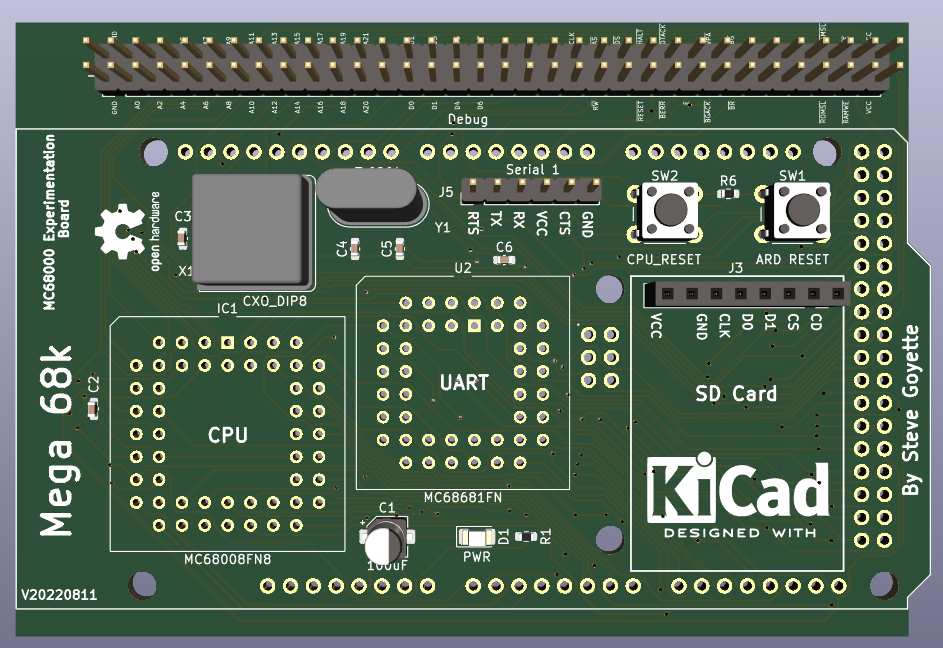

# Steve's Mega68k
This project was inspired by others.  It's the unholy union of an Motorola MC68000 CPU and MC68681 DUART with an Arduino Mega along with an AdaFruit SD Card breakout.  This is my attempt to bootstrap building a single board CPU with appropriate software to make it interesting.  My goals are to get the software to a point where it can run both CP/M 68k and a scaled down version of Linux.  

Right now there are 2 software projects:
- Mega68k freerun - implementing a simple freerun mode
- Mega68k simpleLopp - implementing a simple loop and using the arduino as ROM.

Both of these are in the software sub-directory.
The hardware sub-directory contains the KiKad 6.0 project along with the required symbol and footprint libraries and the gerbers.

For Arduino software development I'm using VSCode and the platformio plugin.  This provides a pleasant and smooth development experience.

For assembler I'm using Easy68k...this provides a less smooth and pleasant development experience but it does work and the simulation is quite useful.

